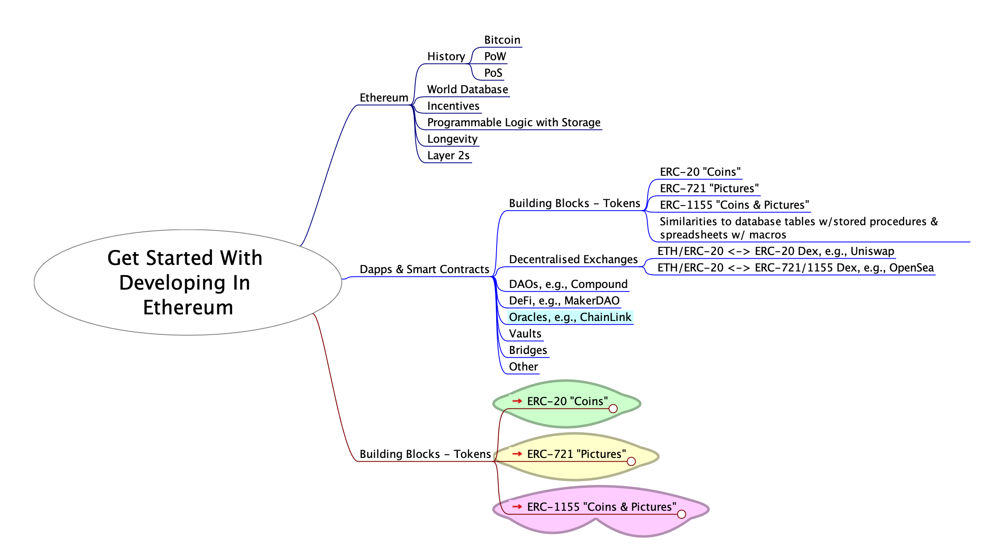
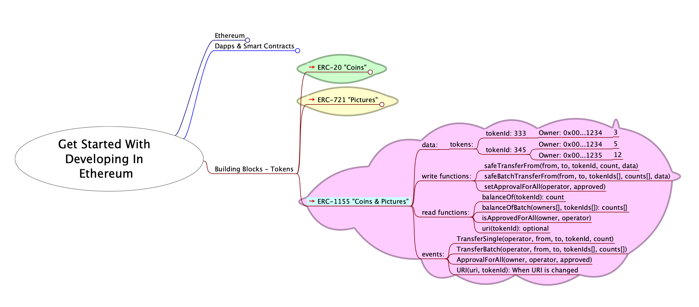

# Get Started With Developing In Ethereum

Materials prepared for [ETHSydney August - Get started with developing in Ethereum](https://lu.ma/42iq2h0p), Tuesday Aug 13 2024.

##### Aim
* Deploy your own ERC-20 token contract
* Interact with your own ERC-20 token contract
* Deploy a "SimpleVault" that operates with your ERC-20 token contract
* Interact with your "SimpleVault"

##### UI For Testing Smart Contracts On Sepolia

[https://bokkypoobah.github.io/GetStartedWithDevelopingInEthereum/](https://bokkypoobah.github.io/GetStartedWithDevelopingInEthereum/)

##### Requirements
* Web browser, with the MetaMask browser plug-in - [https://metamask.io/](https://metamask.io/)
* Sepolia testnet ethers in your MetaMask account. Try https://www.alchemy.com/faucets
* For developing and testing on your local computer, familiarity with the Linux, MacOS or Windows command line. And [npx](https://docs.npmjs.com/cli/v10/commands/npx) to run commands from Node packages.

##### Overview
<kbd></kbd>

##### For Later
* ERC-721 and ERC-1155

<br />

---

## Exercise 1 - Deploy Your Own ERC-20

Go to [https://remix.ethereum.org/](https://remix.ethereum.org/). In the `FILE EXPLORER` tab, create a new `ERC20Token.sol` document under `default_workspace` -> `contracts`. Copy the content from [contracts/ERC20Token.sol](contracts/ERC20Token.sol) and paste into your newly created `ERC20Token.sol` document.

<kbd></kbd>

Change the `_name` and `_symbol` on lines 80 and 81. Save and you should have a green tick below the third icon on the sidebar.

<kbd></kbd>

Switch to the `SOLIDITY COMPILER` tab. Note the `COMPILER` version, `0.8.26+commit.8a87fa7a` in this case. Check that `Enable optimisation` is ticked and the number beside it set to `200`.

<kbd></kbd>

Switch to the `DEPLOY & RUN TRANSACTIONS` tab. Set `ENVIRONMENT` to `Injected Provider - MetaMask` and your MetaMask account should appear under the `ACCOUNT` label.

Select `CONTRACT` to be `ERC20Token - contracts/ERC20Token.sol`.

<kbd></kbd>

Click [Deploy], and [Confirm] your transaction in MetaMask.

<kbd></kbd>

In the bottom pane, you will see your completed transaction and newly created `contract address`. `0xac09587d186d70d93dd9b16328c2e4fa845cc9cf` in this case.

<kbd></kbd>

In this case, my contract can be viewed at https://sepolia.etherscan.io/address/0xac09587d186d70d93dd9b16328c2e4fa845cc9cf.

<kbd></kbd>

Switch to the `Contract` tab.

<kbd></kbd>

Click on [Verify and Publish] to upload the source code for your ERC-20 token contract. Select the `Compiler Type` of `Solidity(Single file)`. Select the `Compiler Version` to compiler version you compiled your contract with, `0.8.26+commit.8a87fa7a` in this case. Select the `Open Source License Type` of `3) MIT License (MIT)`. Click [Continue].

<kbd></kbd>

Paste the contents of ERC20Token.sol from Remix into the text box under `Enter the Solidity Contract Code below`.

<kbd></kbd>

Set `Optimization` to `Yes` and `Runs` to `200`, matching the same parameters in Remix above.

<kbd></kbd>

Click [Verify and Publish].

**CONGRATULATIONS** You have published your contract!

<kbd></kbd>

In this case, my contract code can be viewed at https://sepolia.etherscan.io/address/0xac09587d186d70d93dd9b16328c2e4fa845cc9cf#code.

<kbd></kbd>

My ERC-20 token transactions can be viewed at https://sepolia.etherscan.io/token/0xac09587d186d70d93dd9b16328c2e4fa845cc9cf. You can see `1,000,000` tokens being minted from address `0x0000...0000` to my address.

<kbd></kbd>

Click on the [Holders] tab to view the account holdings.

<kbd></kbd>

#### Exercise 2 - Interact With Your ERC-20 Token Contract

View your ERC-20 token contract on [https://bokkypoobah.github.io/GetStartedWithDevelopingInEthereum/](https://bokkypoobah.github.io/GetStartedWithDevelopingInEthereum/).

Use my newly deployed ERC-20 token contract `0xAC09587d186D70d93dd9B16328C2E4fA845cC9CF`, you can see the initially minted `1,000,000` `TOOSEXY` tokens transferred to my account when my ERC-20 token contract was deployed.

<kbd></kbd>


--- TODO BELOW ---

Create transactions like below:
* Initial mint of 1,000,000 tokens to account1, when your ERC-20 token contract is deployed
* Transfer of 10 tokens from account1 to account2
* Transfer of 1 token from account1 to account2
* account1 approves for account2 to spend 100 tokens
* account2 transfers from account1 0.12345 tokens

<kbd></kbd>

<kbd></kbd>

<kbd></kbd>

<kbd></kbd>

<br />

---

## Exercise 2 - SimpleVault Gadget for ERC-20s

##### Aim
* Deploy and interact with a simple gadget that uses the ERC-20 basic building block

##### Steps
1. Set up the Hardhat testing environment - [https://hardhat.org/docs](https://hardhat.org/docs)
2. Modify [contracts/SimpleVault.sol](contracts/SimpleVault.sol) to break the functionality and confirm with the tests
3. Deploy your own SimpleVault to the Sepolia testnet
4. Send and withdraw some of your very own ERC-20 tokens created in Exercise 1

#### Exercise 1 - Step 1 - Hardhat Testing Environment

```bash
npm install --save-dev hardhat

# Run test
npx hardhat test

# Or run test and save output in ./testIt.out
./10_testIt.sh
#  00_test_0
#    Deployment
#        Signers
#        * owner: 0xf39Fd6e51aad88F6F4ce6aB8827279cffFb92266
#        * otherAccount: 0x70997970C51812dc3A010C7d01b50e0d17dc79C8
#        Deploying ERC20
#        * symbol: MYSYMBOL
#        * name: My Name
#        * decimals: 18
#        * totalSupply: 1000000000000000000000000
#        Deploying SimpleVault
#        * owner: 0xf39Fd6e51aad88F6F4ce6aB8827279cffFb92266
#      ✔ ERC20 token should have the correct symbol, name, decimals and totalSupply (548ms)
#      ✔ ERC20 token should emit an event on transfers and balanceOf adds up
#      ✔ SimpleVault should process token deposits and withdrawals correctly
#
#
#  3 passing (581ms)
```

<br />

---

## Building Blocks - Tokens

### ERC-20 Fungible Tokens - "Coins"

e.g., Bank balance, Opal card balance, transfers

<kbd></kbd>

* [contracts/ERC20Token.sol](contracts/ERC20Token.sol)

### ERC-721 Non-Fungible Tokens - "Pictures"

e.g., Bank account number, Opal card number, drivers license, registry item

<kbd></kbd>

* [contracts/ERC721Token.sol](contracts/ERC721Token.sol)

### ERC-1155 Non-Fungible Tokens - "Coins & Pictures"

e.g., Game items

<kbd></kbd>

* [contracts/ERC1155Token.sol](contracts/ERC1155Token.sol)

<br />

---

<!--
## Screenshots of ERC-20 Explorer

[https://bokkypoobah.github.io/GetStartedWithDevelopingInEthereum/](https://bokkypoobah.github.io/GetStartedWithDevelopingInEthereum/)

### ERC-20 Explorer on Sepolia

<kbd></kbd>
<kbd></kbd>
<kbd></kbd>
<kbd></kbd>
<kbd></kbd>

<br />

---

-->

## Resources

### Solidity

* Solidity compiler and deployer - [https://remix.ethereum.org/](https://remix.ethereum.org/)
* Solidity Documentation - [https://docs.soliditylang.org/](https://docs.soliditylang.org/)
* OpenZeppelin Contracts - [https://github.com/OpenZeppelin/openzeppelin-contracts](https://github.com/OpenZeppelin/openzeppelin-contracts)
* Hardhat development environment - [https://hardhat.org/](https://hardhat.org/)

### Other

* [mindmap/GetStartedWithDevelopingInEthereum-202408.mm](mindmap/GetStartedWithDevelopingInEthereum-202408.mm) that can be viewed in [FreePlane](https://docs.freeplane.org/)

<br />

<br />

Enjoy!

(c) BokkyPooBah / Bok Consulting Pty Ltd 2024. The MIT Licence.
