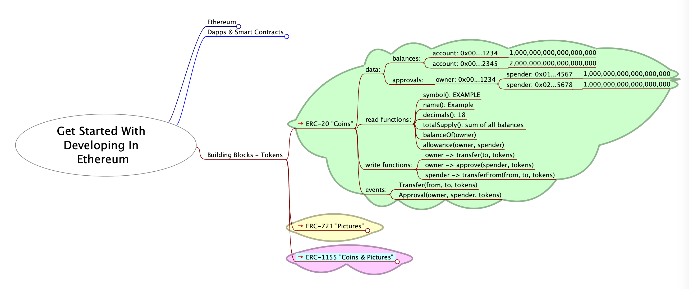
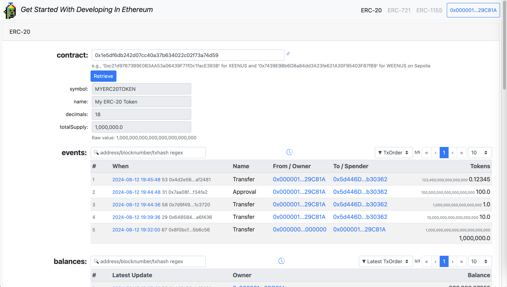
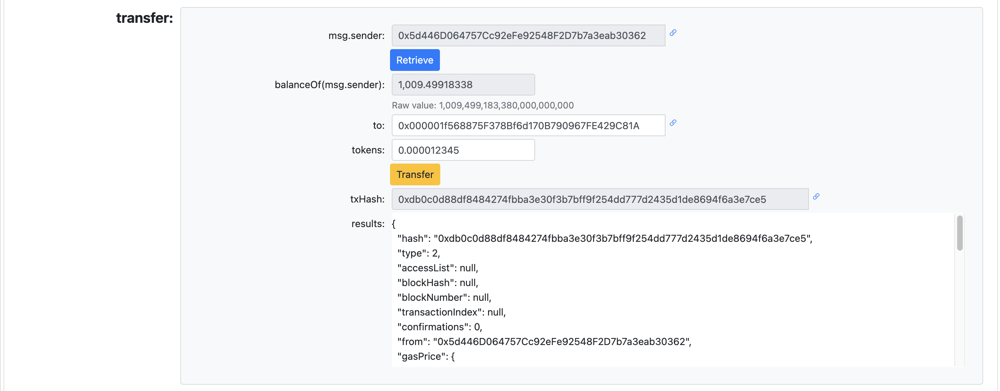

# Get Started With Developing In Ethereum

Materials for [ETHSydney August - Get started with developing in Ethereum](https://lu.ma/42iq2h0p) Tuesday Aug 13 2024.

<kbd></kbd>

###### UI For Testing Smart Contracts On Sepolia

[https://bokkypoobah.github.io/GetStartedWithDevelopingInEthereum/](https://bokkypoobah.github.io/GetStartedWithDevelopingInEthereum/)

 

---

## Building Blocks - Tokens

### ERC-20 Fungible Tokens - "Coins"

e.g., Bank balance, Opal card balance, transfers

<kbd></kbd>

* [contracts/ERC20Token.sol](contracts/ERC20Token.sol)

### ERC-721 Non-Fungible Tokens - "Pictures"

e.g., Bank account number, Opal card number, drivers license, registry item

<kbd></kbd>

* [contracts/ERC721Token.sol](contracts/ERC721Token.sol)

### ERC-1155 Non-Fungible Tokens - "Coins & Pictures"

e.g., Game items

<kbd></kbd>

* [contracts/ERC1155Token.sol](contracts/ERC1155Token.sol)

 

---

## Exercises

* Install MetaMask from [https://metamask.io/](https://metamask.io/).
* Connect to Ethereum Sepolia Testnet
* Get some Sepolia Testnet tokens into 2 accounts

### Deploy ERC-20

Use [https://remix.ethereum.org/](https://remix.ethereum.org/) to deploy your smart contract

<kbd></kbd>

Example [contracts/ERC20Token.sol](contracts/ERC20Token.sol) deployed to Sepolia at [https://sepolia.etherscan.io/address/0x1e5df6db242d07cc40a37b634022c02f73a74d59](https://sepolia.etherscan.io/address/0x1e5df6db242d07cc40a37b634022c02f73a74d59#code)

### View And Interact With Your ERC-20 Contract

View and interact with your ERC-20 token contract on [https://bokkypoobah.github.io/GetStartedWithDevelopingInEthereum/](https://bokkypoobah.github.io/GetStartedWithDevelopingInEthereum/)

Events below show:
* Initial mint of 1,000,000 tokens to account1
* Transfer of 10 tokens from account1 to account2
* Transfer of 1 token from account1 to account2
* account1 approves for account2 to spend 100 tokens
* account2 transfers from account1 0.12345 tokens

<kbd></kbd>

<kbd></kbd>

<kbd></kbd>

<kbd></kbd>

 

---

<!--
## Screenshots of ERC-20 Explorer

[https://bokkypoobah.github.io/GetStartedWithDevelopingInEthereum/](https://bokkypoobah.github.io/GetStartedWithDevelopingInEthereum/)

### ERC-20 Explorer on Sepolia

<kbd></kbd>
<kbd></kbd>
<kbd></kbd>
<kbd></kbd>
<kbd></kbd>

 

---

-->

## Resources

### Solidity

* Solidity compiler and deployer - [https://remix.ethereum.org/](https://remix.ethereum.org/)
* Solidity Documentation - [https://docs.soliditylang.org/](https://docs.soliditylang.org/)
* OpenZeppelin Contracts - [https://github.com/OpenZeppelin/openzeppelin-contracts](https://github.com/OpenZeppelin/openzeppelin-contracts)

### Other

* [mindmap/GetStartedWithDevelopingInEthereum-202408.mm](mindmap/GetStartedWithDevelopingInEthereum-202408.mm) that can be viewed in [FreePlane](https://docs.freeplane.org/)

 

 

Enjoy!

(c) BokkyPooBah / Bok Consulting Pty Ltd 2024. The MIT Licence.
