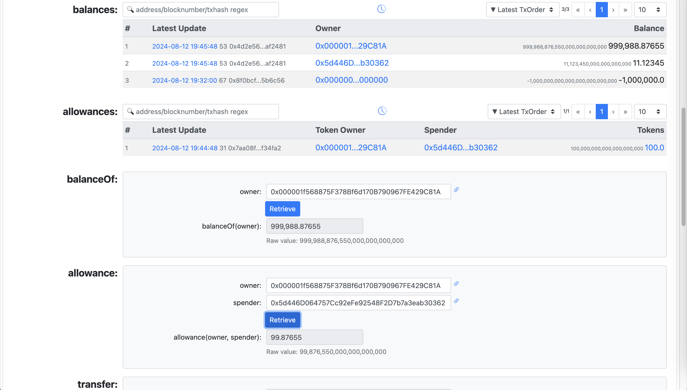
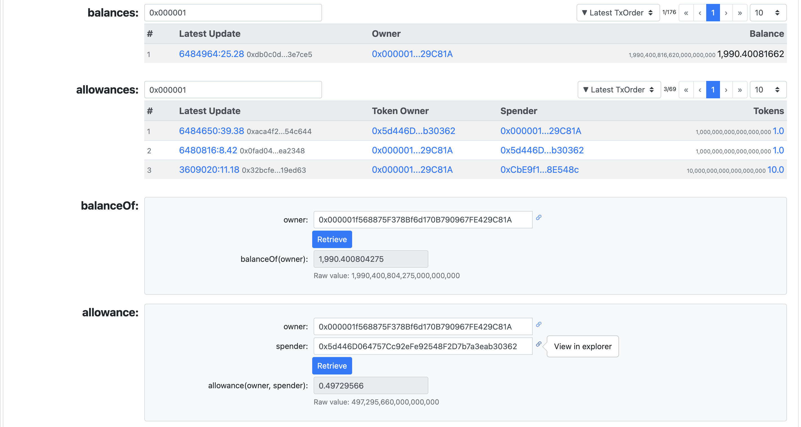
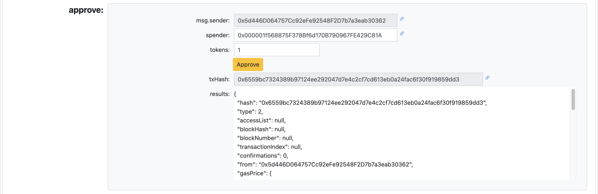
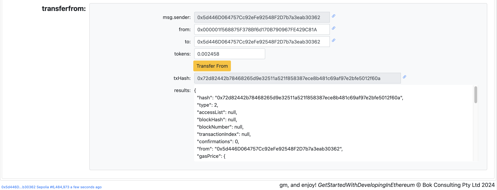

# Get Started With Developing In Ethereum

Materials for [ETHSydney August - Get started with developing in Ethereum](https://lu.ma/42iq2h0p) Tuesday Aug 13 2024.

<kbd></kbd>


###### UI For Testing Smart Contracts On Sepolia

[https://bokkypoobah.github.io/GetStartedWithDevelopingInEthereum/](https://bokkypoobah.github.io/GetStartedWithDevelopingInEthereum/)

<br />

---

## Building Blocks - Tokens

### ERC-20 Fungible Tokens - "Coins"

e.g., Bank balance, Opal card balance, transfers

<kbd></kbd>

* [contracts/ERC20Token.sol](contracts/ERC20Token.sol)

### ERC-721 Non-Fungible Tokens - "Pictures"

e.g., Bank account number, Opal card number, drivers license, registry item

<kbd></kbd>

* [contracts/ERC721Token.sol](contracts/ERC721Token.sol)

### ERC-1155 Non-Fungible Tokens - "Coins & Pictures"

e.g., Game items

<kbd></kbd>

* [contracts/ERC1155Token.sol](contracts/ERC1155Token.sol)

<br />

---

## Exercise 1 - ERC-20

##### Aim
* Familiarise yourself with ERC-20 tokens as a basic building block

##### Steps
1. If required, install MetaMask from [https://metamask.io/](https://metamask.io/) and create your first account
2. Connect MetaMask to the Ethereum Sepolia testnet
3. Obtain some Sepolia testnet ethers in your MetaMask accounts
4. Set up a second MetaMask account and transfer some testnet ethers to your second account
5. Use [https://remix.ethereum.org/](https://remix.ethereum.org/) to deploy your very own ERC-20 token to the Sepolia testnet. You can use [contracts/ERC20Token.sol](contracts/ERC20Token.sol) and customise with very own symbol and name
6. Perform some transactions on your ERC-20 token

#### Exercise 1 - Step 5 - Deploy ERC-20 Token Contract

Use [https://remix.ethereum.org/](https://remix.ethereum.org/) to deploy your smart contract

<kbd></kbd>

Example [contracts/ERC20Token.sol](contracts/ERC20Token.sol) deployed to Sepolia at [https://sepolia.etherscan.io/address/0x1e5df6db242d07cc40a37b634022c02f73a74d59](https://sepolia.etherscan.io/address/0x1e5df6db242d07cc40a37b634022c02f73a74d59#code)

#### Exercise 1 - Step 6 - View And Interact With Your ERC-20 Token Contract

View your ERC-20 token contract on [https://bokkypoobah.github.io/GetStartedWithDevelopingInEthereum/](https://bokkypoobah.github.io/GetStartedWithDevelopingInEthereum/)

Create transactions like below:
* Initial mint of 1,000,000 tokens to account1, when your ERC-20 token contract is deployed
* Transfer of 10 tokens from account1 to account2
* Transfer of 1 token from account1 to account2
* account1 approves for account2 to spend 100 tokens
* account2 transfers from account1 0.12345 tokens

<kbd></kbd>

<kbd></kbd>

<kbd></kbd>

<kbd></kbd>

<br />

---

## Exercise 2 - SimpleVault Gadget for ERC-20s

##### Aim
* Deploy and interact with a simple gadget that uses the ERC-20 basic building block

##### Steps
1. Set up the Hardhat testing environment - [https://hardhat.org/docs](https://hardhat.org/docs)
2. Modify [contracts/SimpleVault.sol](contracts/SimpleVault.sol) to break the functionality and confirm with the tests
3. Deploy your own SimpleVault to the Sepolia testnet
4. Send and withdraw some of your very own ERC-20 tokens created in Exercise 1

#### Exercise 1 - Step 1 - Hardhat Testing Environment

```bash
npm install --save-dev hardhat

# Run test
npx hardhat test

# Or run test and save output in ./testIt.out
./10_testIt.sh
#  00_test_0
#    Deployment
#        Signers
#        * owner: 0xf39Fd6e51aad88F6F4ce6aB8827279cffFb92266
#        * otherAccount: 0x70997970C51812dc3A010C7d01b50e0d17dc79C8
#        Deploying ERC20
#        * symbol: MYSYMBOL
#        * name: My Name
#        * decimals: 18
#        * totalSupply: 1000000000000000000000000
#        Deploying SimpleVault
#        * owner: 0xf39Fd6e51aad88F6F4ce6aB8827279cffFb92266
#      ✔ ERC20 token should have the correct symbol, name, decimals and totalSupply (548ms)
#      ✔ ERC20 token should emit an event on transfers and balanceOf adds up
#      ✔ SimpleVault should process token deposits and withdrawals correctly
#
#
#  3 passing (581ms)
```

<br />

---

<!--
## Screenshots of ERC-20 Explorer

[https://bokkypoobah.github.io/GetStartedWithDevelopingInEthereum/](https://bokkypoobah.github.io/GetStartedWithDevelopingInEthereum/)

### ERC-20 Explorer on Sepolia

<kbd></kbd>
<kbd></kbd>
<kbd></kbd>
<kbd></kbd>
<kbd></kbd>

<br />

---

-->

## Resources

### Solidity

* Solidity compiler and deployer - [https://remix.ethereum.org/](https://remix.ethereum.org/)
* Solidity Documentation - [https://docs.soliditylang.org/](https://docs.soliditylang.org/)
* OpenZeppelin Contracts - [https://github.com/OpenZeppelin/openzeppelin-contracts](https://github.com/OpenZeppelin/openzeppelin-contracts)
* Hardhat development environment - [https://hardhat.org/](https://hardhat.org/)

### Other

* [mindmap/GetStartedWithDevelopingInEthereum-202408.mm](mindmap/GetStartedWithDevelopingInEthereum-202408.mm) that can be viewed in [FreePlane](https://docs.freeplane.org/)

<br />

<br />

Enjoy!

(c) BokkyPooBah / Bok Consulting Pty Ltd 2024. The MIT Licence.
