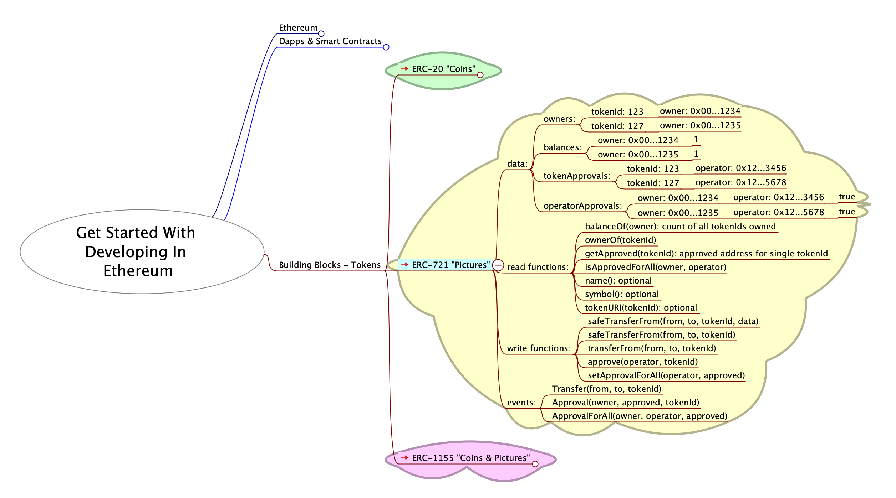

# Get Started With Developing In Ethereum

Materials for [ETHSydney August - Get started with developing in Ethereum](https://lu.ma/42iq2h0p) Tuesday Aug 13 2024.

<kbd></kbd>

 

---

## UI For Testing Smart Contracts On Sepolia

[https://bokkypoobah.github.io/GetStartedWithDevelopingInEthereum/](https://bokkypoobah.github.io/GetStartedWithDevelopingInEthereum/)

<kbd></kbd>

 

---

## Building Blocks - Tokens

### ERC-20 Fungible Tokens - "Coins"

e.g., Bank balance, Opal card balance, transfers

<kbd></kbd>

* [contracts/ERC20Token.sol](contracts/ERC20Token.sol)

### ERC-721 Non-Fungible Tokens - "Pictures"

e.g., Bank account number, Opal card number, drivers license, registry item

<kbd></kbd>

* [contracts/ERC721Token.sol](contracts/ERC721Token.sol)

### ERC-1155 Non-Fungible Tokens - "Coins & Pictures"

e.g., Game items

<kbd></kbd>

* [contracts/ERC1155Token.sol](contracts/ERC1155Token.sol)

 

---

## Resources

### Solidity

* Solidity compiler and deployer - [https://remix.ethereum.org/](https://remix.ethereum.org/)
* Solidity Documentation - [https://docs.soliditylang.org/](https://docs.soliditylang.org/)
* OpenZeppelin Contracts - [https://github.com/OpenZeppelin/openzeppelin-contracts](https://github.com/OpenZeppelin/openzeppelin-contracts)

### Other

* [mindmap/GetStartedWithDevelopingInEthereum-202408.mm](mindmap/GetStartedWithDevelopingInEthereum-202408.mm) that can be viewed in [FreePlane](https://docs.freeplane.org/)

 

 

Enjoy!

(c) BokkyPooBah / Bok Consulting Pty Ltd 2024. The MIT Licence.
